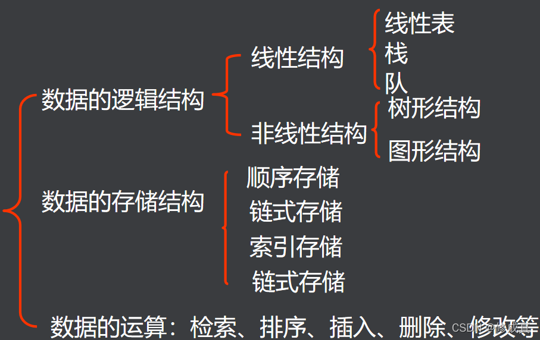
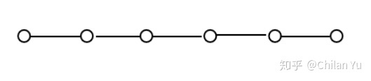
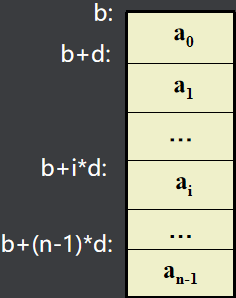
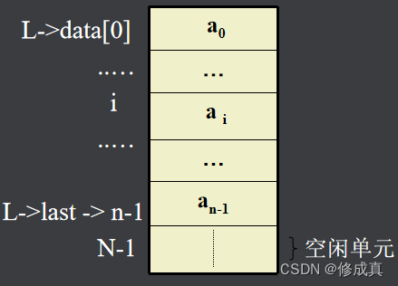
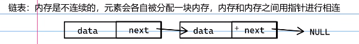
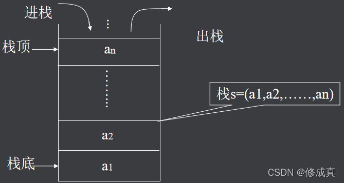

# 引导

有什么数据结构



# 一.线性表

第一个元素a1外，每一个元素有且只有一个直接前驱元素，除了最后一个元素an外，每一个元素有且只有一个直接后继元素。数据元素之间的关系是一对一的关系。



# 1. 线性表之顺序表

线性表邓存储于一片连续的存储空间



特点: 

1.逻辑上相邻的元素的存储位置也是相邻的

2.存储密度高(数据结构中元素所占空间/整个数据结构所占空间)

## 1.1 C语言实现顺序表

```c
#define  N 100        //宏定义储存数，方便调整
typedef   int  data_t; //重定义数据类型，方便数据转换
typedef  struct                     
{   data_t data[N]； //表的存储空间
     int list;   //最后一位数据的位置
}   sqlist, *sqlink;
```

## 1.2 顺序表的基本运算

### 1.2.1 创建空表sqlink sqlist_creat()

```c
/**
 * @description: 顺序表创建 
 * @param {无}
 * @return {sqlink-成功返回顺序表的地址，NULL-失败返回}
 */
sqlink sqlist_creat()
{
	sqlink sq = malloc(sizeof(sqlist));
	if(sq == NULL)
	{
		#if DEBUG
		printf("sqlist creat erorr!\n");
		#endif
		return NULL;
	}

	memset(sq,0,sizeof(sqlist));
	sq->list = -1;

	return sq;
}
```

### 1.2.2 删除表int sqlist_delete(sqlink sq)

```c
/**
 * @description: 顺序表删除
 * @param表 {sqlink-传递顺序表的地址} 
 * @return {1-函数成功，0-函数失败}
 */
int sqlist_delete(sqlink sq)
{
	if(sq == NULL)
	{
		#if DEBUG
		printf("sqlist has been delete or sqlist isn't exist!\n");
		#endif
		return 0;
	}

	free(sq);
	sq = NULL;

	return 1;
}
```

### 1.2.3 置空表int sqlist_clear(sqlink sq)

```c
/**
 * @description: 顺序表清空
 * @param {sqlink-传递顺序表的地址} 
 * @return {1-函数成功，0-函数失败}
 */
int sqlist_clear(sqlink sq)
{
	if(sq == NULL)
	{
		#if DEBUG
		printf("sqlist isn't exist!\n");
		#endif
		return 0;
	}

	if(sq->list == -1)
	{
		#if DEBUG
		printf("The sqlist has been clear!\n");
		#endif
		return 0;
	}
	else
	{
		memset(sq,0,sizeof(sqlist));
		sq->list = -1;
		return 1;
	}
}

```

### 1.2.4 判断是否为空表int sqlist_empty(sqlink sq)

```c
/**
 * @description: 查看顺序表是否为空
 * @param {sqlink-传递顺序表的地址} 
 * @return {1-表为空，-1，表不空，0-函数失败}
 */
int sqlist_empty(sqlink sq)
{
	
	if(sq == NULL)
	{
		#if DEBUG
		printf("sqlist isn't exist!\n");
		#endif
		return 0;
	}

	if(sq->list == -1)
		return 1;
	else
		return -1;
}

```

### 1.2.5 求表长int sqlist_length(sqlink sq)

```c
/**
 * @description:求顺序表长度 
 * @param {sqlink-传递顺序表的地址} 
 * @return {储存数据的长度，0-函数失败}
 */
int sqlist_length(sqlink sq)
{	
	if(sq == NULL)
	{
		#if DEBUG
		printf("sqlist isn't exist!\n");
		#endif
		return 0;
	}

	return sq->list+1; // 由于sq->list是下标所以要+1
}

```

### 1.2.6 元素查找int sqlist_element_query(sqlink sq,unsigned int i)

```c
/**
 * @description: 顺序表元素查找
 * @param {sqlink-传递顺序表的地址} 
 * @param {unsigned int-查找元素的位置} 
 * @return {i位置的元素，0-函数失败}
 */
int sqlist_element_query(sqlink sq,unsigned int i)
{	
	if(sq == NULL)
	{
		#if DEBUG
		printf("sqlist isn't exist!\n");
		#endif
		return 0;
	}
	if(i > sq->list)
	{	
		#if DEBUG
		printf("i too big\n");
		#endif
		return 0;
	}
	
	return sq->data[i];
}

```

### 1.2.7 遍历列表int sqlist_ergodic(sqlink sq)

```c
/**
 * @description: 顺序表遍历所有元素
 * @param {sqlink-传递顺序表的地址} 
 * @return {1-函数成功，0-函数失败}
 */
int sqlist_ergodic(sqlink sq)
{	
	int i;
	if(sq == NULL)
	{
		#if DEBUG
		printf("sqlist isn't exist!\n");
		#endif
		return 0;
	}
	if(sq->list == -1)
	{
		#if DEBUG
		printf("sqlist is empty!\n");
		#endif
		return 0;
	}
	for(i = 0; i < sq->list+1; i++)
		printf("%d ", sq->data[i]);
	puts("");

	return 1;
}

```

## 1.3 基本运算的相关算法

### 1.3.1 插入Insert(L,x,i)

> 若表存在空闲空间，且参数i满足：0≤i≤L->last+1,则可进行正常插入。
> 插入前，将表中（L->data[L->last]～L->data[i]）部分顺序下移一个位置
> 然后将x插入L->data[i]处即可。算法对应的表结构。

```c
/**
 * @description: 顺序表插入数据
 * @param {sqlink-传递顺序表的地址}
 * @param {unsigned int-插入数据的位置} 
 * @param {data_t-插入的数据} 
 * @return {1-函数成功，0-函数失败}
 */
int sqlist_insert(sqlink sq, unsigned int i, data_t x)
{	
	int n;

	if(sq == NULL)
	{
		#if DEBUG
		printf("sqlist isn't exist!\n");
		#endif
		return 0;
	}
	if(sq->list == N-1)
	{
		#if DEBUG
		printf("sqlist already full!\n");
		#endif
		return 0;
	}
	if(i > sq->list+1)
	{
		#if DEBUG
		printf("i is too big!\n");
		#endif
		return 0;
	}

	for(n = sq->list; i < n+1; n--)
		sq->data[n+1] = sq->data[n];
	sq->data[i] = x;
	sq->list++;

	return 1;
}

```



### 1.3.2 删除DeleteSqlist(L, i)

> 若参数i满足：0≤i≤L->last, 将表中L->data[i+1]∽L->data[L->last] 部分顺序向上移动一个位置， 覆盖L->data[i]。

```c
/**
 * @description: 删除中元素
 * @param {sqlink-传递顺序表的地址} 
 * @param {unsigned int-删除数据的位置} 
 * @return {1-函数成功，0-函数失败}
 */
int sqlist_element_delete(sqlink sq, unsigned int i)
{	
	if(sq == NULL)
	{
		#if DEBUG
		printf("sqlist isn't exist!\n");
		#endif
		return 0;
	}
	if(i > sq->list)
	{
		#if DEBUG
		printf("i is too big!\n");
		#endif
		return 0;
	}
	
	for(; i < sq->list; i++)
		sq->data[i] = sq->data[i+1];
	sq->data[sq->list] = 0;
	sq->list--;

	return 1;
}

```

# 2. 线性表之单链表

2.1 链表的链式存储

> 将`线性表L=(a0,a1,……,an-1)`中`各元素`分布在存储器的`不同存储块`，称为`结点`，通过`地址或指针`建立元素之间的联系
>
> `结点`的`data域`存放`数据元素ai`，而`next域`是一个指针，指向ai的直接`后继ai+1`所在的结点。




## 2.1 C语言实现链表节点

```c
typedef struct node
{   
	data_t   data;   //结点的数据域//
	struct node *next;  //结点的后继指针域//
}listnode, *linklist;
```

## 2.2 链表的基本运算

### 2.2.1 创建链表节点linklist linknode_create()

```c
/**
 * @description:单链表创建 
 * @param {*}
 * @return {链表头指针}
 */
linklist linknode_create()
{
	linklist H = malloc(sizeof(linknode)); //开辟头指针空间
	if(H == NULL)
	{
		return 0;
	}

	H->data = 0;    
	H->next = NULL;

	return H;
}
```

### 2.2.2 插入之尾插法int linknode_tail_insert(linklist H, data_t value)

```c
/**
 * @description: 尾插法增添链表元素 
 * @param {linklist} H -头指针
 * @param {data_t} value -结点的数据
 * @return {0-函数失败，1-函数成功}
 */
int linknode_tail_insert(linklist H, data_t value)
{
	linklist p = NULL,q = H;   

	if(H == NULL)
	{
		DEBUG_NULL();
		return 0;
	}
	
	p = (linklist)malloc(sizeof(linknode));  //结点空间开辟
	if(p == NULL)
	{
		DEBUG_CREATE();
		return 0;
	}
	p->data = value;
	p->next = NULL;

	while(q->next)  //遍历到最后链表最后一位结点
		q = q->next;
	q->next = p;

	return 1;
}
```

### 2.2.3 插入之头插法int linknode_head_insert(linklist H, data_t value)

```c
/**
 * @description: 头插法增添链表元素 
 * @param {linklist} H -头指针
 * @param {data_t} value -结点的数据
 * @return {0-函数失败，1-函数成功}
 */
int linknode_head_insert(linklist H, data_t value)
{
	linklist p = NULL,q = H;   

	if(H == NULL)
	{
		DEBUG_NULL();
		return 0;
	}
	
	p = (linklist)malloc(sizeof(linknode));  //结点空间开辟
	if(p == NULL)
	{
		DEBUG_CREATE();
		return 0;
	}
	p->data = value;
	p->next = q->next;

	return 1;
}
```

### 2.2.4 链表查找linklist linknode_element_inqure(linklist H, int i)

> 从链表的`a0`起，判断是否为`第i结点`，若是则`返回该结点的指针`，否则查找下一结点,依次类推

```c
/**
 * @description:链表元素查询 
 * @param {linklist} H -链表头指针
 * @param {int} i -查询的位置
 * @return {结点位置的地址}
 */
linklist linknode_element_inqure(linklist H, int i)
{
	int n = -1;
	if(H == NULL)
	{
		DEBUG_NULL();
		return 0;
	}

	if(i == -1)
		return H;
	if(i < -1)
	{
		#if DEBUG
		printf(" i value error !\n");
		#endif
		return 0;
	}
	while(n < i)
	{
		H = H->next;
		if(H == NULL)
		{
			#if DEBUG
			printf("i is too big!\n");
			#endif
			return 0;
		}
		n++;
	}
	return H;
}

```

### 2.2.5 链表遍历int linkshow(linklist H)

```c
/**
 * @description:链表遍历 
 * @param {linklist} H -链表头指针
 * @return {0-函数失败，1-函数成功}
 */
int linkshow(linklist H)
{
	if(H == NULL)
	{
		DEBUG_NULL();
		return 0;
	}

	while(H->next)
	{
		H = H->next;
		printf("%d ", H->data);
	}
	puts("");

	return 1;
}

```

## 2.3 基本运算相关算法

### 2.3.1 链表结点的插入

> 调用`链表查找linknode_element_inqure(h, i-1)`，获取`结点ai-1`的`指针p`(ai 之前驱)，然后申请一个`q结点`，存入`x`，并将其插入`p`指向的结点之后。

```c
/**
 * @description: 链表元素按位置插入
 * @param {linklist} H -链表头结点指针
 * @param {data_t} value -插入结点的值
 * @param {int} i -插入的位置
 * @return {0-函数失败，1-函数成功}
 */
int linknode_element_insert(linklist H, data_t value, int i)
{	
	linklist p,q = (linklist)malloc(sizeof(linknode));
	if(q == NULL)
	{
		DEBUG_CREATE();
		return 0;
	}
	if(H == NULL)
	{
		DEBUG_NULL();
		free(q);
		return 0;
	}

	p = linknode_element_inqure(H, i-1);
	if(p == NULL)
	{
		free(q);
		return 0;
	}

	q->data = value;

	q->next = p->next;
	p->next = q;

	return 1;
}

```

### 2.3.2 删除整个链表

```c
/**
 * @description: 链表删除
 * @param {linklist} H -链表头指针
 * @return {0-函数失败，1-函数成功}
 */
int linknode_delete(linklist H)
{
	linklist p = H;
	if(H == NULL)
	{
		DEBUG_NULL();
		return 0;
	}

	while(p)
	{
		p = p->next;  //指针前移
		free(H);   //释放上一个结点
		H = p;
	}

	return 1;
}
```

# 二.栈

只在一端(栈顶)允许进行插入和删除操作


